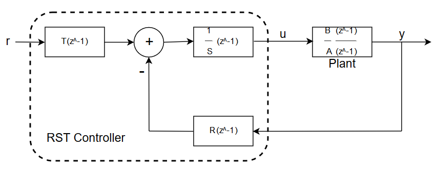

# RSTcontroller
MATLAB function to design a RST controller via the pole placement method.

## Controller structure
RST controllers are two degrees of freedom controllers allowing them to have different performances for tracking and regulation.
The controller has the following structure:


## Controller design
The RST controller can be designed using the designRST.m function contained in the repository. The function uses the pole placement method to place the pole of the closed-loop system to those specified. Please refer to the help in the file to do so.

## Using the controller
Once a RST controller has been designed, the control signal can be computed as follows:
```
u(t) = T*r(t) - R.* [y(t) ... y(t-nr)] + S.*[0 u(t-1) ... u(t-ns)]
```
Thus, some past command, reference and output values must be kept to compute the command signal at each sampling time.

## Authors

* **Thomas Havy**
* **Loïc Niederhauser**

## License

This project is licensed under the MIT License - see the [LICENSE.md](LICENSE.md) file for details
